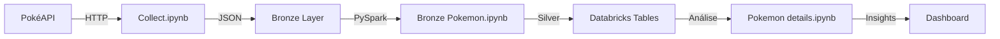

# Coleta de Dados

> 📚 **Projeto de Estudos**: Este é um projeto educacional desenvolvido para explorar técnicas de coleta, armazenamento e processamento de dados em diferentes contextos e escalas.

## 📋 Visão Geral

Este projeto consolida múltiplos pipelines de coleta de dados de diferentes fontes, explorando práticas de engenharia de dados com foco em armazenamento em camadas (Bronze/Silver/Gold) e processamento distribuído usando PySpark e Databricks.

Cada módulo coleta dados de fontes distintas, demonstrando diferentes técnicas de web scraping e integração com APIs, com posterior transformação e análise usando PySpark.

---

## 🏗️ Estrutura do Projeto

```
coleta_de_dados/
├── main.py                           # Entrypoint principal do projeto
├── pyproject.toml                    # Configuração de dependências (pip/uv)
├── README.md                         # Este arquivo
│
├── jovem_nerd/                       # Coleta de episódios do Jovem Nerd
│   ├── main.py                       # Classe Collector para a API JN
│   └── data/
│       ├── json/                     # Dados brutos em JSON
│       └── parquet/                  # Dados transformados em Parquet
│
├── tab_news/                         # Coleta de notícias da TabNews
│   ├── main.py                       # Script de coleta da API TabNews
│   ├── read_spark.py                 # Leitura com PySpark
│   └── data/
│       └── contents/
│           ├── json/                 # Dados brutos em JSON
│           └── parquet/              # Dados transformados em Parquet
│
├── residente_evil/                   # Web scraping do Resident Evil Database
│   ├── main.py                       # Scraper com BeautifulSoup
│   └── data/                         # Armazenamento de dados coletados
│
└── Pokemon/                          # Análise de dados Pokémon
    ├── Collect.ipynb                 # Coleta de dados da API Pokémon
    ├── Bronze Pokemon.ipynb           # Transformação de Bronze para Silver (Databricks)
    ├── Pokemon details.ipynb          # Enriquecimento e análise de detalhes (Databricks)
    └── data/
        ├── json/                      # Dados brutos em JSON
        └── parquet/                   # Dados processados em Parquet
```

---

## 📦 Dependências

O projeto utiliza as seguintes bibliotecas:

- **requests** - Requisições HTTP para APIs
- **beautifulsoup4** - Web scraping de HTML/XML
- **pandas** - Manipulação de dados (DataFrames)
- **pyspark** - Processamento distribuído de dados
- **pyarrow** - Suporte para formato Parquet
- **fastparquet** - Escrita otimizada de Parquet
- **tqdm** - Barra de progresso para loops
- **python >= 3.14** - Runtime

---

## 📊 Módulos de Coleta

### 1. **Jovem Nerd** (`/jovem_nerd`)

**Fonte**: API do Jovem Nerd  
**Dados**: Episódios de podcasts do canal Jovem Nerd

**Características**:

- Classe `Collector` reutilizável para diferentes fontes de dados
- Coleta via API REST com suporte a parâmetros customizáveis
- Dupla persistência: JSON (dados brutos) e Parquet (otimizado)
- Tratamento de erros e status HTTP

**Uso**:

```python
from jovem_nerd.main import Collector

collector = Collector(
    url='https://api.jovemnerd.com.br/wp-json/jovemnerd/v1/nerdcasts/',
    instance_name='jovem_nerd'
)
collector.get_and_save(save_format='json')
```

---

### 2. **TabNews** (`/tab_news`)

**Fonte**: API TabNews  
**Dados**: Notícias e conteúdos da comunidade TabNews

**Características**:

- Script de coleta contínua com paginação automática
- Interrupção inteligente com filtro de data
- Delay entre requisições para respeitar rate-limits
- Leitura com PySpark em `read_spark.py`

**Uso**:

```bash
python tab_news/main.py
```

**Leitura com PySpark**:

```python
from pyspark.sql import SparkSession

spark = SparkSession.builder.appName('TabNews').getOrCreate()
df = spark.read.format('json').load('./data/contents/json/')
df.show()
```

---

### 3. **Resident Evil** (`/residente_evil`)

**Fonte**: Web Scraping - Resident Evil Database  
**Dados**: Personagens e informações do universo Resident Evil

**Características**:

- Web scraping com BeautifulSoup
- Headers customizados para contornar proteções
- Extração de informações estruturadas (basic info, aparições)
- Tratamento de requests com timeout e retry

**URL Base**: `https://www.residentevildatabase.com/`

---

### 4. **Pokémon** (`/Pokemon`)

**Fonte**: PokéAPI  
**Dados**: Informações completas sobre Pokémon (estatísticas, tipos, detalhes)

**Notebooks**:

- **Collect.ipynb** - Extração inicial de dados da API
- **Bronze Pokemon.ipynb** - Transformação de Bronze para Silver (Databricks)
- **Pokemon details.ipynb** - Enriquecimento com detalhes e análise (Databricks)

**Características**:

- Integração completa com Databricks
- Arquitetura em camadas (Bronze → Silver)
- Uso de tabelas Spark gerenciadas
- SQL queries para transformação de dados
- Persistência em `/mnt/datalake/pokemon/`

---

## 💾 Arquitetura de Armazenamento

### Estratégia de Múltiplas Camadas

```t
Dados Brutos (JSON)
        ↓
   Processamento (Pandas/PySpark)
        ↓
Parquet Otimizado
        ↓
Databricks Tables (Bronze/Silver)
        ↓
Análise & Dashboards
```

### Formatos Suportados

| Formato               | Uso                                 | Localização       |
| --------------------- | ----------------------------------- | ----------------- |
| **JSON**              | Dados brutos, preservação completa  | `data/*/json/`    |
| **Parquet**           | Armazenamento otimizado, compressão | `data/*/parquet/` |
| **Databricks Tables** | Processamento distribuído, SQL      | `/mnt/datalake/`  |

### Nomes de Arquivo

Todos os arquivos podem ser nomeados com **timestamp** para rastreabilidade:

```t
2026-03-04 15:35:50.123456.json
2026-03-04 15:35:50.123456.parquet
```

---

## 🔗 Integração com Databricks

O projeto integra-se ao Databricks para:

### 1. **Notebooks Databricks**

- PySpark notebooks nativos em formato `.ipynb` (compatível com Databricks)
- Acesso direto a datasets via catálogo (`bronze.pokemon.pokemon`)

### 2. **Processamento Distribuído**

```python
from pyspark.sql import SparkSession

spark = SparkSession.builder.appName('DataProcessing').getOrCreate()

# Leitura de arquivos locais ou Databricks
df = spark.read.json('./data/contents/json/')

# Ou de tabelas gerenciadas
df = spark.table('bronze.pokemon.pokemon')

# Transformações distribuídas
df_filtered = df.filter(df.level > 10)
df_filtered.write.parquet('./data/processed/')
```

### 3. **Data Lake Structure**

```t
/mnt/datalake/
├── pokemon/
│   ├── pokemon/          # Dados brutos coletados
│   └── details/          # Dados enriquecidos
└── other_sources/        # Outras fontes futuras
```

---

## 🚀 Como Executar

### Instalação

```bash
# Clone o repositório
git clone <repo-url>
cd coleta_de_dados

# Setup de ambiente (com poetry/uv)
uv venv
source .venv/bin/activate

# Instale dependências
uv sync
# ou
pip install -r requirements.txt
```

### Executar Coletas

```bash
# Executar coleta completa
python main.py

# Executar módulo específico
python tab_news/main.py
python residente_evil/main.py

# Usar no Databricks (notebooks)
# Abra os arquivos .ipynb em um workspace Databricks
```

### Visualizar Dados com PySpark

```bash
python tab_news/read_spark.py
```

---

## 📈 Casos de Uso

### Para Estudantes

- ✅ Aprender coleta de dados com múltiplas abordagens (API, Scraping)
- ✅ Praticar transformação com Pandas e PySpark
- ✅ Explorar formatos (JSON, Parquet)
- ✅ Integração com plataformas Cloud (Databricks)

### Para Engenheiros de Dados

- ✅ Padrão de `Collector` reutilizável
- ✅ Arquitetura em camadas (Bronze/Silver/Gold)
- ✅ Tratamento de erros e rate-limiting
- ✅ Persistência em múltiplos formatos

---

## 🔄 Fluxo de Dados (Exemplo: Pokémon)



---

## 📝 Notas Importantes

### Sobre Datasets Públicos

- Respeitar `robots.txt` de sites
- Implementar delays entre requisições
- Verificar termos de uso das APIs

### Performance

- Usar Parquet para grandes volumes
- Coalescer partições antes de escrever em single file
- Lazy evaluation no PySpark

### Escalabilidade

- Cambiar entre local (Pandas) e distribuído (PySpark) conforme necessário
- Usar Databricks para volumes > 1GB
- Implementar checkpoints para pipelines longos

---

## 🛠️ Tecnologias

| Categoria         | Tecnologia                |
| ----------------- | ------------------------- |
| **Coleta**        | requests, BeautifulSoup4  |
| **Processamento** | Pandas, PySpark           |
| **Armazenamento** | JSON, Parquet, Databricks |
| **Análise**       | PySpark SQL, Databricks   |
| **Ferramentas**   | Python 3.14+, uv/pip      |

---

## 📚 Referências

- [PySpark Docs](https://spark.apache.org/docs/latest/api/python/)
- [Databricks Documentation](https://docs.databricks.com/)
- [BeautifulSoup Docs](https://www.crummy.com/software/BeautifulSoup/)
- [Pandas Documentation](https://pandas.pydata.org/docs/)
- **Dados**: Resident Evil Database, PokéAPI, TabNews API, Jovem Nerd API

---

**Última atualização**: Março de 2026  
**Versão**: 0.1.0  
**Autor**: Projeto de Estudos em Engenharia de Dados
